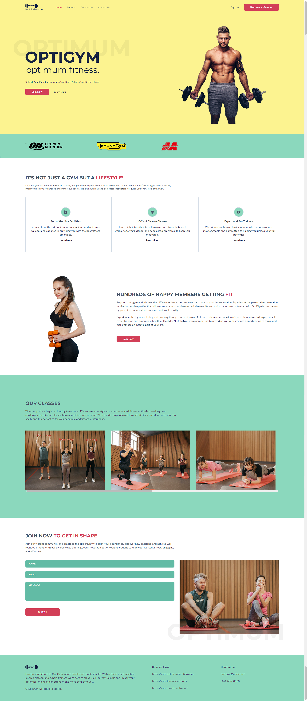
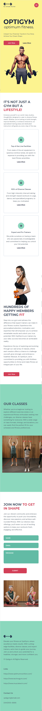

# OptiGym App

A responsive gym application built with Typescript and React:
- Styled with Tailwindcss.
- Animationed with Framer Motion.
- Smooth scrolling with React Anchor Link Smooth Scroll.
- Form validation with React Hook Form.
- Form submission to formsubmit.co


## Installation

Install with:

```bash
  npm install 
```


## Screenshots

Please see below screenshots for Desktop and Mobile views.

**Desktop View:**



**Mobile View:**




## Live Demo

[App Link](https://optigym.netlify.app/)